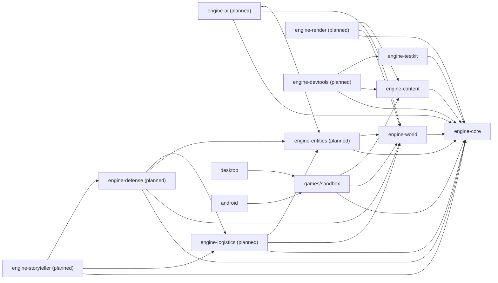
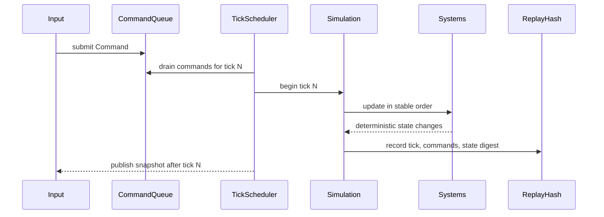

# MyEngine Architecture

Status: Draft accepted for Phase 03  
Last updated: 2026-07-02

This document defines the intended module boundaries before production engine behavior is
implemented. The scaffold contains only the first buildable modules; later modules should be added
when their phase starts and should follow these contracts.

## Module Graph

Hard rule: no simulation module may depend on `android`, `desktop`, Android SDK classes, or render
backend classes. Rendering and input observe snapshots and submit commands; they do not mutate
authoritative world state directly.

## Runtime Flow

1. A launcher starts a game descriptor from `games/sandbox` or a future game module.
2. The game descriptor selects content packs and initial scenario data.
3. `engine-content` validates and materializes definitions into a `ContentRegistry`.
4. `engine-core` creates an `Engine` with a fixed tick scheduler, command queue, seed, and system
   ordering.
5. Simulation modules update authoritative state on fixed ticks only.
6. Rendering receives immutable snapshots or read-only views.
7. Persistence stores versioned world state, content references, command/replay metadata, and
   migration markers.

## Simulation Tick Flow

Rules:

- ticks are integer-indexed and fixed-step;
- commands are explicit, serializable, and ordered;
- RNG is seedable and owned by simulation services;
- systems run in a stable declared order;
- replay hash changes are test-visible.

## Render And Input Flow

Input adapters convert platform events into engine commands. They may do gesture interpretation,
selection, camera control, and UI routing, but they do not mutate simulation objects.

Renderers consume snapshots. A renderer may cache sprites, atlases, draw batches, and debug overlays,
but cached render data is disposable and never authoritative.

## Content Loading Flow

1. Read pack manifests and definitions from approved sources.
2. Check schema version, content version, engine compatibility, IDs, dependencies, and localization.
3. Validate references across definitions.
4. Build an immutable `ContentRegistry`.
5. Reject invalid packs before simulation starts.

Content validation must run in JVM tests without Android.

## Save And Load Flow

1. Save files include `saveVersion`, engine version, content pack IDs/versions, RNG state, tick,
   command log pointer, world state, entities, systems, and scenario metadata.
2. Loading checks version compatibility and content availability.
3. Migrations transform older saves at explicit boundaries.
4. Save/load roundtrips must preserve deterministic replay hashes for stable scenarios.

## Test Strategy Per Module

| Module | Required tests before production behavior is done |
|---|---|
| `engine-core` | fixed tick, command ordering, RNG repeatability, replay hash |
| `engine-world` | coordinate math, occupancy, buildability, serialization boundaries |
| `engine-content` | schema validation, cross-reference validation, migration samples |
| `engine-entities` | stable IDs, system ordering, component persistence |
| `engine-ai` | job assignment determinism, cancellation, starvation scenarios |
| `engine-logistics` | inventory invariants, recipe throughput, producer/consumer loops |
| `engine-defense` | targeting order, damage rules, wave determinism |
| `engine-storyteller` | incident budgets, pacing repeatability, bounds tests |
| `engine-render` | snapshot-only reads, camera math, screenshot/visual smoke tests |
| `android` | lifecycle smoke, save location, input forwarding, frame pacing |
| `engine-devtools` | scenario runner, replay inspector, content validation CLI |

## Non-Goals For V1

- Multiplayer, lockstep networking, or server authority.
- A general-purpose 3D engine.
- A full editor before deterministic runtime, save/load, and replay gates are proven.
- Production campaign scope, monetization, or release tooling.
- Copying reference game mechanics, content, art, schemas, or file layouts.

